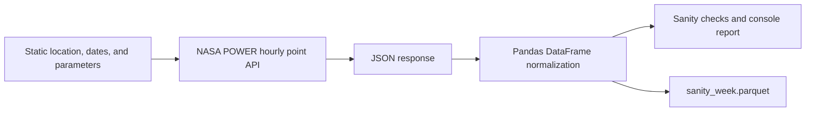

# Solar Data Sanity Pull

## System purpose

This repository currently implements a small data-ingestion validation system for a future solar forecasting pipeline. It retrieves one known week of hourly meteorological and solar-radiation data from the NASA POWER API for Port of Spain, Trinidad and Tobago, validates basic assumptions about the response, and saves the normalized data as a Parquet file.

The current system verifies that the upstream data is suitable for a larger historical pull. It does **not** yet perform forecasting, model training, feature engineering, or a multi-year download.

## Architecture and data flow



The complete implementation is in `sanity_pull.py`:

1. `fetch()` sends an HTTPS GET request to the NASA POWER hourly point endpoint.
2. `to_frame()` extracts the returned parameter series, parses hourly timestamps, sorts the index, and replaces NASA's `-999.0` fill value with missing values.
3. `report()` prints the variables and units returned by NASA, evaluates the solar-radiation profile, counts rows and missing cells, and prints an overall pass/fail result.
4. The main block writes the resulting frame to `sanity_week.parquet`.

## Input configuration

Configuration is currently defined as module-level constants rather than command-line arguments or environment variables.

| Setting | Value | Meaning |
| --- | --- | --- |
| Latitude | `10.6549` | Port of Spain point latitude |
| Longitude | `-61.5019` | Port of Spain point longitude |
| Start | `20230101` | First requested day, inclusive |
| End | `20230107` | Last requested day, inclusive |
| Community | `RE` | NASA POWER renewable-energy community |
| Time standard | `LST` | Local solar time |
| Response format | `JSON` | API response serialization |
| Fill value | `-999.0` | Upstream missing-data sentinel |

The request targets:

```text
https://power.larc.nasa.gov/api/temporal/hourly/point
```

## Data contract

Each output row represents one hour in local solar time. The DataFrame index is a timezone-naive `DatetimeIndex` parsed from NASA timestamps in `YYYYMMDDHH` format.

| Column | Description | API unit | Stored type |
| --- | --- | --- | --- |
| `ALLSKY_SFC_SW_DWN` | All-sky surface shortwave downward irradiance, used as GHI | `Wh/m^2` | `float64` |
| `T2M` | Air temperature at 2 metres | `C` | `float64` |
| `RH2M` | Relative humidity at 2 metres | `%` | `float64` |
| `WS10M` | Wind speed at 10 metres | `m/s` | `float64` |
| `CLOUD_AMT` | Cloud amount | `%` | `float64` |
| `PW` | Precipitable water | `cm` | `float64` |

The expected output shape for the configured seven-day interval is 168 rows by 6 columns.

## Validation behavior

The run is marked as passed only when all of these conditions hold:

- NASA serves all six requested variables.
- Mean GHI during hours 21:00-04:00 is below `20 Wh/m^2`.
- Mean GHI during hours 11:00-13:00 is between `300` and `1100 Wh/m^2`.
- The response contains exactly 168 hourly rows.

The report also displays API-provided units, maximum GHI, and the total number of missing cells after fill-value replacement.

Missing cells and duplicate timestamps fail validation, preventing incomplete data from being accepted silently.

## Latest verified run

The sanity pull was run successfully on 2026-06-21 against the live NASA POWER service. It produced:

| Check | Result |
| --- | --- |
| Variables served | All 6 requested variables |
| Rows | 168 |
| Missing cells | 0 |
| Duplicate timestamps | 0 |
| Timestamp range | 2023-01-01 00:00 through 2023-01-07 23:00 LST |
| Mean night GHI | `0.00 Wh/m^2` |
| Mean midday GHI | `632.73 Wh/m^2` |
| Maximum GHI | `794.62 Wh/m^2` |
| Overall result | Passed |

## Quick start

Create an isolated environment and install the project:

```bash
python -m venv .venv
source .venv/bin/activate
python -m pip install -e .
python sanity_pull.py
```

For development checks:

```bash
python -m pip install -e ".[dev]"
ruff check .
pytest
```

A successful run replaces `sanity_week.parquet` in the current working directory and prints the sanity report to standard output. HTTP errors, timeouts, connection failures, unexpected response structures, and Parquet serialization failures terminate the process with an exception.

## Current limitations

- The location, date range, variables, and output path are hard-coded.
- The HTTP request has a 120-second timeout but no retry or backoff policy.
- Response schema and data types are assumed rather than formally validated.
- The output file is overwritten without versioning or provenance metadata.
- No full 2019-2024 ingestion loop or forecasting model has been implemented.

## Intended next stage

Once the input contract and validation policy are finalized, the same fetch-normalize-validate pattern can be extended to annual requests for the planned 2019-2024 historical dataset. That expansion should add configuration, retries, explicit schema validation, completeness thresholds, reproducible dependencies, partitioned outputs, and tests before model-development work begins.
